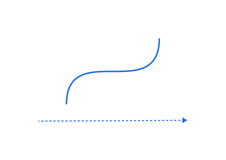

<h1 align="center" style="text-align:center">Interpol 👮🏽‍</h1>
<p align="center">


</p>
<p align="center">

</p>

interpol library interpolates value between two points.
This is the lowest level of animate machine.
Interpol is not a DOM API, it provides real time progress of the interpolation that can be use or bind
on... anything!


## Summary

- [Install](#install)
- [Show me some code](#show-me-some-code)
  - [Interpol](#interpol)
  - [Timeline](#timeline)
- [Real word example](#real-word-example)
- [Easing](#easing)
- [API](#api)
  - [interpol constructor](#interpol-constructor)
  - [interpol methods](#interpol-methods)
  - [Timeline constructor](#timeline-constructor)
  - [Timeline methods](#timeline-methods)
- [Dev examples](#dev-examples)

## Install

```shell
npm i @wbe/interpol
```

## Show me some code

### Interpol

```js
import { Interpol } from "@wbe/interpol"

new Interpol({
  props: {
    v: [0, 100],
  },
  duration: 1000,
  onUpdate: ({ v }, time, progress) => {
    // do something with `v` value
  },
})
```

In this example:
- `v` will be interpolated between 0 and 100 during 1 second
- `time` is the current time in millisecond
- `progress` is the current progress between 0 and 1

➡️ [Interpol codesandbox](https://codesandbox.io/p/sandbox/interpol-ease-35mqw9?file=%2Fsrc%2FApp.tsx%3A1%2C1)

### Timeline

Chain interpol instancies with Timeline:

```js
import { Interpol, Timeline } from "@wbe/interpol"

const itp1 = new Interpol({
  props: {
    v: [0, 100],
  },
})
const itp2 = new Interpol({
  props: {
    v: [-100, 100],
  }
})

const tl = new Timeline()
  .add(itp1)
  .add(itp2)
```

## Real word example

Interpol as been built for animate DOM element too. In this case, you can use the `onUpdate` callback to update the DOM element style.

```ts
import { Timeline } from "@wbe/interpol"

// The DOM element we want to animate
const element = document.querySelector("div")

// Create a timeline instance
const tl = new Timeline({ 
  paused: true,
  onComplete: () => {
    tl.isReversed() 
      ? console.log("Timeline reverse is complete") 
      : console.log("Timeline is complete")
  },
})

// `add()` can recieve an Interpol object constructor
tl.add({
  props: {
    x: [-100, 100],
    y: [-100, 100],
  },
  duration: 1000,
  ease: t => t * (2 - t),
  onUpdate: ({ x, y }) => {
    element.style.transform = `translate3d(${x}px, ${y}px, 0px)`
  },
  onComplete: () => {
    console.log("This interpol is complete")
  },
});

tl.add({
    props: {
      width: [10, 50],
    },
    duration: 500,
    ease: t => t * t,
    onUpdate: ({ width }) => {
        element.style.width = `${width}%`
    },
  },
  // set an offset duration, 
  // this interpol will start 100ms before the previous interpol end
  -100)

await tl.play()
// timeline is complete

await tl.reverse()
// timeline reverse is complete
```

➡️ [Timeline codesandbox](https://codesandbox.io/p/sandbox/interpol-timeline-xmdvcf?file=%2Fsrc%2Fmain.ts%3A1%2C1)

## Easing

`ease` & `reversedEase` functions are used to interpolate the progress value. the default one is `(t) => t`.

```js
new Interpol({
  ease: (t) => 1 - Math.pow(1 - t, 4),
})
```

["GSAP like" ease functions](./packages/interpol/src/core/ease.ts) are available in interpol as string too:

```js
import { Interpol, Power3 } from "@wbe/interpol"

// as typed string
new Interpol({
  ease: "power3.out",
})

// or, import the object
new Interpol({
  ease: Power3.out,
})
```

## API

### interpol constructor

```ts
interface IInterpolConstruct<K extends keyof Props> {
  // props are an interpol list object
  // default: /
  props: Record<K, [number | (() => number), number | (() => number)]>

  // Interpolation duration between `from` and `to` values (millisecond).
  // ex: 1000 is 1 second
  // default: `1000`
  duration?: number | (() => number)

  // Interpol easing function
  // default: `t => t` (lineal easing)
  ease?: EaseName | ((t: number) => number)

  // Overwrite easing function on reverse
  // default: /
  reverseEase?: EaseName | ((t: number) => number)

  // Make interpol paused at start (not autoplay)
  // default: `false`
  paused?: boolean

  // Add delay before first start
  // default: `false`
  delay?: number

  // Enable @wbe/debug to get interpol instance logs
  // exe in your console `localStorage.debug = "interpol:*"`
  // default: `false`
  debug?: boolean

  // Called when interpol is ready to play
  // default: /
  beforeStart?: () => void

  // Called on frame update
  // default: /
  onUpdate?: (props?: Record<K, number>, time?: number, progress?: number) => void

  // Called when interpol is complete
  // default: /
  onComplete?: (props?: Record<K, number>, time?: number, progress?: number) => void
}
```

### Interpol methods

```ts
import { Interpol } from "@wbe/Interpol"

const itp = new Interpol({
  paused: true, // disable autoplay
  props: { value: [0, 100] },
})

// Play the interpol
// play(from: number = 0): Promise<any>
itp.play(from)

// Reverse and play the interpol
// reverse(from: number = 1): Promise<any>
itp.reverse(from)

// Pause the interpol
// pause(): void
itp.pause()

// Resumes playing without altering direction (forward or reversed).
// resume(): void
itp.resume()

// Stop the interpol, will reset time, delta and progress.
// stop(): void
itp.stop()

// Compute ['from', 'to'] and 'duration' values if there are functions
// refreshComputedValues(): void
itp.refreshComputedValues()

// Seek to a specific time
// seek(progress: number): void
// progress: number between 0 and 1
itp.seek(progress)
```

### Timeline constructor

```ts
interface ITimelineConstruct {
  // Execute on frame update
  // default: /
  onUpdate?: (time: number, progress: number) => void

  // Execute on complete
  // default: /
  onComplete?: (time: number, progress: number) => void

  // Enable @wbe/debug to get interpol instance logs
  // exe in your console `localStorage.debug = "interpol:Timeline"`
  // default: `false`
  debug?: boolean

  // Pass a Ticker instance with custom params
  // default: `new Ticker()`
  ticker: Ticker

  // disable timeline autoplay
  // default: `false`
  paused: boolean
}
```

### Timeline methods

```ts
import { Timeline } from "@wbe/Interpol"

const tl = new Timeline()

// Add new Interpol object param
// or Interpol instance
// add(interpol: Interpol | IInterpolConstruct, offset: number = 0): Timeline
tl.add(Interpol, offset)

// start the timeline
// play(from: number = 0): Promise<any>
tl.play(from)

// reverse and play the timeline
// reverse(from: number = 1): Promise<any>
tl.reverse(from)

// paused the timeline, will keep time, delta and progress.
// pause(): void
tl.pause()

// resume the timeline after pause.
// resume(): void
tl.resume()

// stop the timeline, will reset time, delta and progress.
// stop(): void
tl.stop()

// seek to a specific time
// seek(progress: number): void
// progress is a number between 0 and 1
tl.seek(progress)
```

## Dev examples

```shell
# install dependencies
pnpm i

# build and watch lib changes
pnpm run build:watch

# start tests and watch
pnpm run test:watch

# start dev server for all examples
pnpm run dev

# Or run a specific example
pnpm run dev --scope interpol-basic
```

## Credits

- [gsap](https://greensock.com/gsap/)
- [animate](https://github.com/SolalDR/animate/)
- [animini](https://github.com/dbismut/animini)
- [signal](https://github.com/zouloux/signal)

## License

See the LICENSE file for license rights and limitations (MIT).
