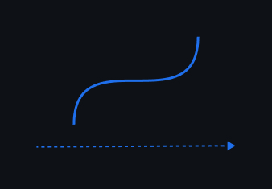

<h1 align="center" style="text-align:center">Interpol 👮🏽‍</h1>
<p align="center">
    
</p>

interpol library interpolates value between two points.
This is the lowest level of animate machine.
Interpol is not a DOM API, it provides a real time progress of the interpolation that can be use or bind
on... anything!

## Why

I've been using gsap for a long time, but often don't need all the features provided.
Interpol is low level, it can be used as in most cases for only ~= 3k gzip.
However, the API voluntarily takes over (in part) the gsap API for easier adoption for gsap users like me.

## Install

```shell
$ npm i @wbe/interpol
```

## Show me some code

Single Interpol:

```js
import { Interpol } from "@wbe/interpol"

const itp = new Interpol({
  from: 0,
  to: 100,
  duration: 1000,
  onUpdate: ({ time, value, progress }) => {},
  onComplete: () => {},
})
```

[interpol codesandbox](https://codesandbox.io/s/interpol-basic-forked-z5vdwr)

Chain interpols with Timeline:

```js
import { Interpol, Timeline } from "@wbe/interpol"

const itp1 = new Interpol({
  from: 0,
  to: 100,
  duration: 1000,
  onUpdate: ({ time, value, progress }) => {
    // ...
  },
})
const itp2 = new Interpol({
  from: 0,
  to: 500,
  duration: 7000,
  onUpdate: ({ time, value, progress }) => {
    // ...
  },
})

const tl = new Timeline()
tl.add(itp1)
tl.add(itp2)

tl.play()
```

Advanced timeline:

```js
import { Timeline } from "@wbe/interpol"

const tl = new Timeline({
  onUpdate: ({ time, value, progress }) => {
    // global timeline update
  },
  onComplete: () => {
    // timeline is complete!
  },
  // enable @wbe/debug on this timeline by adding `localStorage.debug = "interpol:*"`
  // in your browser's console
  debug: true,
})

// `add` method can recieve an interpol object without creat an interpol instance
tl.add({
  from: 0,
  to: 100,
  duration: 1000,
  onUpdate: ({ time, value, progress }) => {
    // here is current interpol update
  },
})
tl.add(
  {
    from: -100,
    to: 100,
    duration: 500,
    onUpdate: ({ time, value, progress }) => {
      // current interpol update
    },
  },
  // set a negatif offsetDuration
  -100
)

tl.play()
```

[timeline codesandbox](https://codesandbox.io/s/timeline-basic-forked-w9cy9c)

## API

### interpol constructor

```ts
interface IInterpolConstruct {
  // Start interpolation value
  // default: `0`
  from?: number | (() => number)

  // End interpolation value
  // default: /
  to?: number | (() => number)

  // Interpolation duration between `from` and `to` values (millisecond).
  // ex: 1000 is 1 second
  // default: `1000`
  duration?: number | (() => number)

  // Interpol easing function
  // default: `t => t` (lineal easing)
  ease?: (t: number) => number

  // Overwrite easing function on reverse
  // default: /
  reverseEase?: (t: number) => number

  // Make interpol paused at start (not autoplay)
  // default: `false`
  paused?: boolean

  // Add delay before first start
  // default: `false`
  delay?: number

  // Enable @wbe/debug to get interpol instance logs
  // exe in your console `localStorage.debug = "interpol:*"`
  // default: `false`
  debug?: boolean

  // Called before start
  // default: /
  beforeStart?: () => void

  // Called on frame update
  // default: /
  onUpdate?: ({ value, time, progress }: IUpdateParams) => void

  // Called when interpol is complete
  // default: /
  onComplete?: ({ value, time, progress }: IUpdateParams) => void
}
```

### Interpol methods

```ts
import { Interpol } from "./Interpol"

const itp = new Interpol({
  paused: true, // disable autoplay
  from: 0,
  to: 100,
  beforeStart: () => {},
  onUpdate: ({ value, time, progress }) => {},
  onComplete: ({ value, time, progress }) => {},
})

// Play the interpol
// play(): Promise<any>
itp.play().then(() => {
  // itp complete
})

// Pause the interpol
// pause(): void
itp.pause()

// Stop the interpol, will reset time, delta and progress.
itp.stop()

// Replay from start the interpol.
// replay(): void
itp.replay()

// Reverse and play the interpol
// reverse(): Promise<any>
itp.reverse().then(() => {
  // itp complete
})

// Compute 'from' 'to' and 'duration' values if there are functions
// refreshComputedValues(): void
itp.refreshComputedValues()
```

### Timeline constructor

```ts
interface ITimelineConstruct {
  // Execute on frame update
  // default: /
  onUpdate?: ({ time, progress }) => void

  // Execute on complete
  // default: /
  onComplete?: ({ time, progress }) => void

  // Enable @wbe/debug to get interpol instance logs
  // exe in your console `localStorage.debug = "interpol:Timeline"`
  // default: `false`
  debug?: boolean
}
```

### Timeline methods

```ts
import { Timeline } from "./Interpol"

const tl = new Timeline({
  onUpdate: () => {},
  onComplete: () => {},
  onRepeatComplete: () => {},
})

// Add new Interpol object param
// or Interpol instance
// add(interpol: Interpol | IInterpolConstruct, offsetPosition: number = 0): Timeline
tl.add(
  {
    from: 10,
    to: 1000,
    onUpdate: ({ value, time, progress }) => {
      // ...
    },
  },
  // offset duration
  // this one will start the current interpol 100ms before the last interpol end.
  -100
)

// start the timeline
// Timeline don't have autoplay
// play(): Promise<any>
tl.play().then(() => {
  // tl complete
})

// paused the timeline
// pause(): void
tl.pause()

// stop
// stop(): void
tl.stop()

// restart the timeline
// replay(): void
tl.replay()

// reverse and play the timeline
// reverse(): Promise<any>
tl.reverse().then(() => {
  // tl complete
})
```

## Dev examples

```shell
# install dependencies
pnpm i

# build and watch lib changes
npm run build:watch

# start tests and watch
npm run test:watch

# start dev server on selected example
npm run dev:interpol-basic
npm run dev:timeline-basic
```

## Credits

- [gsap](https://greensock.com/gsap/)
- [animate](https://github.com/SolalDR/animate/)
- [animini](https://github.com/dbismut/animini)
- [signal](https://github.com/zouloux/signal)
